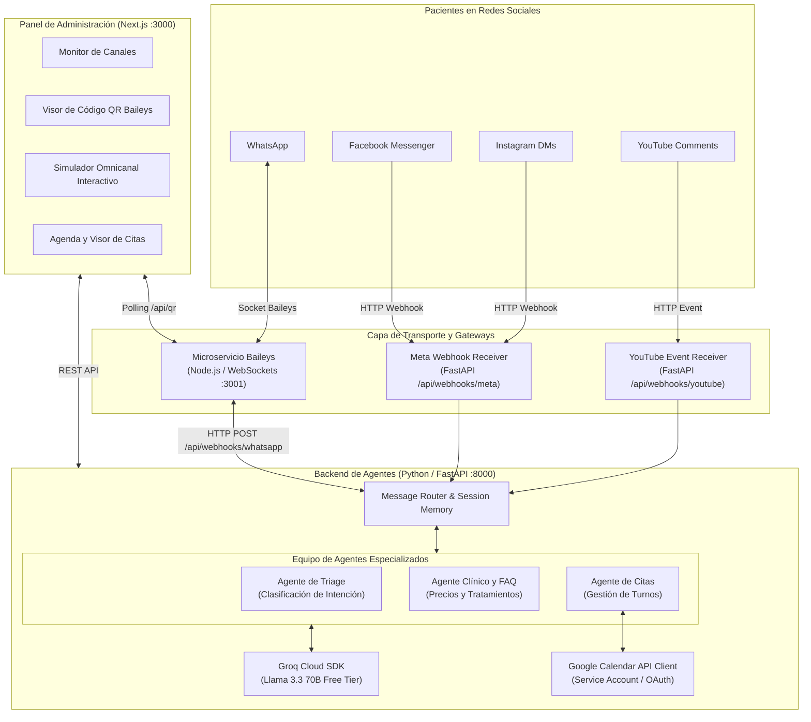
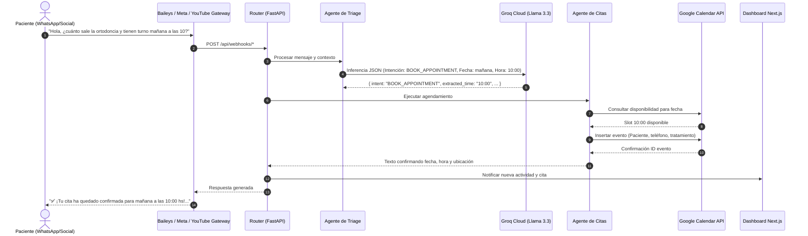

# PRD y Documento de Arquitectura: Sistema Multi-Agente Omnicanal para Clínica Dental

**Estado:** Especificación Validada  
**Versión:** 1.0.0  
**Fecha:** 2026-09-20  
**Costo Operativo:** $0 USD (Free-Tier estricto)

---

## 1. Product Requirements Document (PRD)

### 1.1 Visión del Producto y Objetivos
El **Sistema Multi-Agente Omnicanal para Clínica Dental** automatiza la atención 24/7 de pacientes a través de las cuatro redes sociales y canales de mensajería más utilizados (**WhatsApp, Facebook Messenger, Instagram Direct y YouTube**).

Su misión principal es captar pacientes interesados, resolver dudas sobre tratamientos y precios orientativos, consultar disponibilidad en tiempo real y agendar citas directamente en **Google Calendar**, todo supervisado desde un panel de administración web en **Next.js**.

### 1.2 Usuarios y Personas
1. **Paciente / Prospecto (Omnicanal):**
   - Escribe un mensaje directo o comentario en cualquiera de las redes.
   - Requiere respuesta instantánea (< 3 segundos), lenguaje claro, empático y profesional.
   - Busca conocer precios aproximados, horarios, ubicación y confirmar un turno sin fricción ni llamadas telefónicas.
2. **Personal de Recepción / Odontólogo Administrador:**
   - Supervisa las citas agendadas de forma automática en Google Calendar y en el panel web.
   - Vincula la línea de WhatsApp de la clínica escaneando el código QR generado por Baileys desde la pantalla.
   - Visualiza en vivo el flujo de conversaciones y audita qué agente respondió y qué intención detectó.

### 1.3 Criterios de Éxito Medibles
- **Disponibilidad:** 24 horas al día, 7 días a la semana sin interrupciones.
- **Tiempo de Respuesta:** Inferencia y despacho de mensajes en menos de 2.5 segundos (gracias a Groq LPU).
- **Precisión de Agendamiento:** 0% de solapamiento de turnos; validación obligatoria contra disponibilidad de Google Calendar y horarios laborales (09:00 a 19:00).
- **Seguridad Ética:** Cero diagnósticos médicos vinculantes; toda respuesta clínica debe aclarar que el diagnóstico definitivo y presupuesto final se establecen en el consultorio.
- **Costo Operativo:** $0 USD mensuales garantizados utilizando herramientas open-source y cuotas gratuitas.

### 1.4 Alcance y Límites (Boundaries)

| Categoría | Dentro del Alcance (In Scope) | Fuera del Alcance (Out of Scope) |
|---|---|---|
| **Canales** | WhatsApp (Baileys), Facebook Messenger, Instagram DMs y Comentarios de YouTube | Telegram, TikTok, llamadas telefónicas por voz |
| **IA** | Groq API Free Tier (Llama 3.3 70B / Llama 3.1 8B) | APIs de pago (OpenAI GPT-4o, Anthropic Claude de pago) |
| **Mensajería** | Conexión WebSocket directa con Baileys (código QR) | Twilio, Meta WhatsApp Business API oficial de pago |
| **Automatización**| Webhooks directos en FastAPI | Zapier, Make.com u orquestadores con suscripción |
| **Clínica** | Información de catálogo, precios base, cálculo de citas y confirmación | Diagnósticos médicos definitivos, prescripción de fármacos |

---

## 2. Mapa de Capacidades (Capability Map)

| Módulo ID | Responsabilidad | Dependencias |
|---|---|---|
| `core-agent-engine` | Clasificación de intenciones (Triage), generación de respuestas clínicas y FAQ | Groq API |
| `calendar-integration` | Verificación de slots libres y persistencia de eventos | Google Calendar API |
| `whatsapp-bridge` | Conexión WebSocket mediante Baileys y exposición de QR para escaneo | `core-agent-engine` |
| `social-gateways` | Recepción y normalización de webhooks de Facebook, Instagram y YouTube | `core-agent-engine` |
| `clinic-dashboard` | Monitor multicanal, escáner QR en vivo y visualizador de citas | `calendar-integration`, `whatsapp-bridge` |

**Orden de Construcción:** `core-agent-engine` → `calendar-integration` → `whatsapp-bridge` → `social-gateways` → `clinic-dashboard`

---

## 3. Arquitectura del Sistema

### 3.1 Diagrama de Arquitectura Global

### 3.2 Diagrama de Secuencia: Flujo de Consulta y Agendamiento

---

## 4. Especificación Técnica de Componentes

### 4.1 Backend en Python (`backend/`)
- **Framework:** FastAPI 0.141+ sobre Python 3.14.
- **Estructura:**
  - `app/config.py`: Parámetros de la clínica, horarios (09:00 - 19:00), duración de turnos (45 min) y claves de API.
  - `app/data/clinic_info.json`: Catálogo de 6 tratamientos clave (Limpieza, Blanqueamiento, Ortodoncia, Implantes, Endodoncia, Extracciones) con rangos de precios y FAQs.
  - `app/services/groq_service.py`: Cliente de Groq con soporte de fallback inteligente para ejecución offline o sin credenciales.
  - `app/services/calendar_service.py`: Conector de Google Calendar API con validación de conflictos y almacenamiento en memoria para demostración sin configuración previa.
  - `app/agents/dental_agents.py`: Orquestador `DentalAgentCoordinator` y agentes `TriageAgent`, `DentalFAQAgent`, `AppointmentAgent`.
  - `app/main.py`: Endpoints REST y manejadores de webhooks multicanal.

### 4.2 Servicio WhatsApp Baileys (`whatsapp-service/`)
- **Motor:** Node.js v24+ y `@whiskeysockets/baileys`.
- **Mecanismo:** Emula sesión de WhatsApp Web mediante sockets TCP y cifrado de clave pública/privada almacenado localmente en `auth_info_baileys/`.
- **Endpoints:**
  - `GET /api/status`: Estado de la conexión (`disconnected`, `waiting_for_scan`, `connected`).
  - `GET /api/qr`: Imagen base64 (Data URL) del código QR para renderizado inmediato en Next.js.
  - `POST /api/connect`: Inicia el socket.
  - `POST /api/disconnect`: Cierra la sesión y purga las credenciales para permitir nuevo escaneo.

### 4.3 Panel de Administración (`frontend/`)
- **Tecnología:** Next.js 15 (App Router), React 19, TypeScript y Tailwind CSS.
- **Componentes:**
  - `Header`: Estado de los servicios centrales (Groq AI, Google Calendar).
  - `ChannelsGrid`: Tarjetas interactivas de los 4 canales con estado en tiempo real.
  - `QrModal`: Modal emergente con el código QR dinámico de Baileys para escanear con la cámara del celular.
  - `OmnichannelSimulator`: Interfaz interactiva para probar conversaciones simuladas desde cualquiera de las 4 plataformas, mostrando el agente resolutor y la intención detectada.
  - `AppointmentsList`: Lista en tiempo real de citas confirmadas por los agentes.

---

## 5. Reglas y Límites Operativos (Boundaries)

### Siempre Hacer (Always)
1. Formatear las respuestas de los agentes para ser breves, empáticas y legibles en dispositivos móviles.
2. Validar que la fecha solicitada para una cita caiga dentro del horario laboral (09:00 a 19:00) y que no colisione con turnos previos.
3. Acompañar cualquier estimación de precios con la aclaración de que el presupuesto final se entrega tras la valoración clínica presencial.
4. Mantener tests automatizados con `pytest` pasando al 100%.

### Consultar Primero (Ask First)
1. Modificar los precios o tratamientos en `clinic_info.json`.
2. Alterar la duración estándar de los turnos (45 minutos) o los horarios de apertura y cierre de la clínica.
3. Cambiar el modelo de Groq asignado (`llama-3.3-70b-versatile`).

### Nunca Hacer (Never)
1. Integrar librerías o pasarelas de pago de terceros (Twilio, Zapier, Make) que impliquen costos recurrentes.
2. Emitir diagnósticos clínicos vinculantes o recomendar medicamentos con receta médica por chat.
3. Sobrescribir o cancelar citas existentes en el calendario sin la confirmación explícita del paciente o del administrador.
4. Subir archivos con secretos o credenciales reales (`credentials.json`, `.env`) a repositorios públicos.

---

## 6. Estrategia de Verificación y Comandos

### Comandos de Ejecución
- **Iniciar todo el sistema:** `.\start-all.ps1` (PowerShell) o `start-all.bat` (CMD).
- **Backend Unit Tests:** `$env:PYTHONPATH="backend"; .\venv\Scripts\pytest.exe backend/tests/test_dental_agents.py -v`
- **Build de Producción Frontend:** `cd frontend; npm run build`
- **Frontend Dev:** `cd frontend; npm run dev`
- **WhatsApp Service:** `cd whatsapp-service; node index.js`

### Criterios de Aceptación de Pruebas
1. `test_health_check`: El endpoint raíz `/` debe responder 200 con estado de canales y servicios.
2. `test_chat_faq_flow`: El agente debe responder con precios y detalles ante una consulta de implantes/limpieza.
3. `test_calendar_slots_and_booking`: Al reservar un turno en una hora determinada, esa hora debe desaparecer inmediatamente de los slots disponibles para esa fecha.
4. `test_multichannel_webhooks`: Los endpoints de YouTube y WhatsApp deben aceptar payloads de sus respectivas plataformas y retornar respuestas estructuradas.
